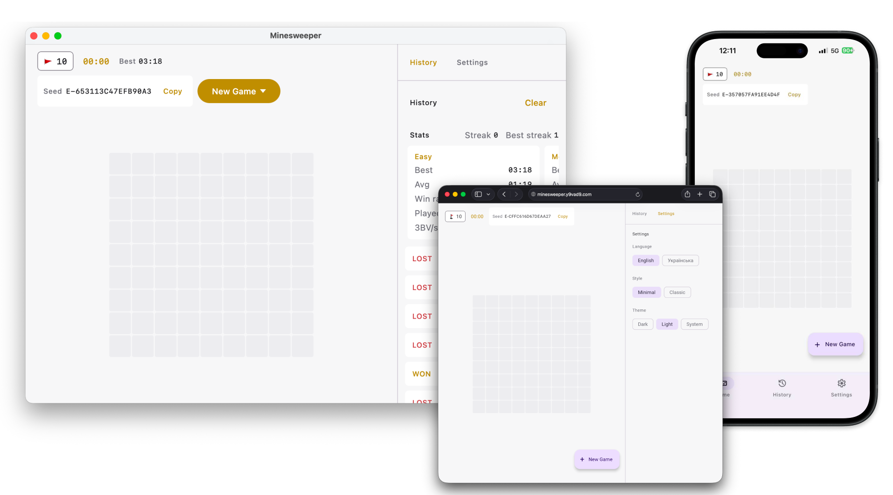

[English](README.md)

# Сапер

Кросплатформна гра «Сапер», створена за допомогою Kotlin Multiplatform і Compose Multiplatform. Працює на десктопі, Android, iOS та в браузері зі спільної кодової бази.



## Можливості

- Класичні правила «Сапера» з безпечним першим кліком і автоматичним відкриттям порожніх клітинок.
- Рівні складності Easy, Medium і Hard, а також власні розміри поля.
- Коди гри та сіди, якими можна поділитися, щоб відтворити те саме поле.
- Режим прапорців, акордовий клік і історія ігор із найкращим часом.
- Дві теми оформлення (Minimal і Classic), світла/темна теми та локалі English/Ukrainian.
- Незавершені ігри зберігаються та відновлюються після перезапуску застосунку.

## Модулі

- `logic` — правила гри й основні моделі, без UI та платформного коду.
- `data` — збереження даних (налаштування, історія, збережена гра) для кожної платформи.
- `ui` — спільний інтерфейс на Compose і стори FlowMVI.
- `desktop`, `android`, `ios`, `web` — точки входу для платформ.

## Вимоги

- JDK 21
- Android SDK (для цілі Android)
- Xcode (для цілі iOS)

## Запуск

Десктоп:

```
./gradlew :desktop:run
```

Веб (відкриває браузер):

```
./gradlew :web:wasmJsBrowserDevelopmentRun
```

Android (підключений пристрій або емулятор):

```
./gradlew :android:installDebug
```

iOS: відкрийте `iosApp` у Xcode і запустіть на симуляторі чи пристрої.

## Тести

```
./gradlew jvmTest
```

## Технології

Kotlin Multiplatform, Compose Multiplatform, FlowMVI, Koin, SQLDelight.
